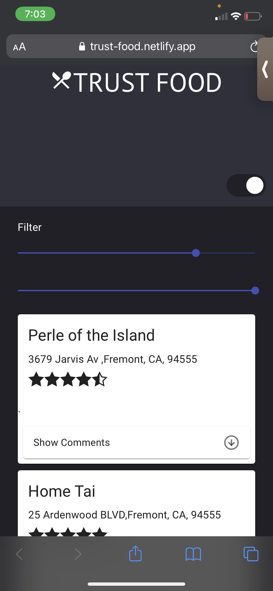

# Launch your own restaurant review site

You've chosen to get started in the restaurant review business! Your goal is to create an easy-to-use, simple service that offers reviews of restaurants around you

For this project, I had to learn to use external APIs such as Google Maps and Google Places (your biggest competitor 😬). That's not all: you will have to integrate all this information in a clear, organized way in your application!

This project is my 7th project in the Front-End Developer path on [Open Classroom](https://openclassrooms.com/)

## Tech Stack

- HTML5
- CSS 3
- ReactJS
- React Hooks

## Step 1: Restaurant 
Start with the real foundation of your application. There will be 2 main sections:

- A Google Maps map loaded with the Google Maps API

- A list of restaurants on the right side of the page that are within the area displayed on the map

The Google Maps map will focus immediately on the position of the user. You'll use the JavaScript geolocation API. A specific color marker should be shown at the user's current location.

A list of restaurants is provided as JSON data in a separate file. Normally, this data would be returned to the backend of your application by an API, but for this exercise, it's sufficient just to load the list of restaurants directly into memory!

Here's a sample JSON file with 2 restaurants pre-filled in there (you should create your own):

## Step 2: Add restaurants and reviews

Your visitors would also like to give their opinions on restaurants!

Let them:

 - Add a review about an existing restaurant

 - Add a restaurant by clicking on a specific place on the map

Once a review or restaurant has been added, it should appear immediately on the map. A new marker will show the position of the new restaurant.

The information will not be saved if they leave the page (it will just be saved in memory for the duration of the visit).

## Step 3: Integration with Google Places API
For the moment, there are not many restaurants or reviews. Fortunately, Google Places offers an API to retrieve restaurants and reviews! Use it to display additional restaurants and reviews on your map so you don't have to use only your JSON file

## App Starter

## Mobile view

## Add new resto in the map

## Available Scripts

In the project directory, you can run:

### `npm start`

Runs the app in the development mode.\
Open [http://localhost:3000](http://localhost:3000) to view it in the browser.

The page will reload if you make edits.\
You will also see any lint errors in the console.

### `npm Install`
For installing all dependencies